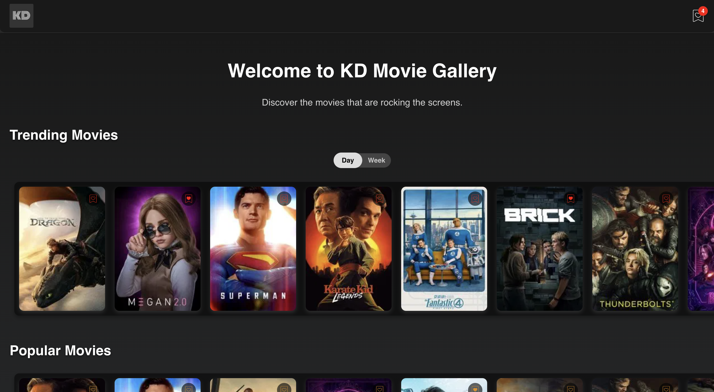

# 🎥 KD Movie Gallery

Welcome to **KD Movie Gallery**, a modern and visually stunning movie gallery application. This project allows users to browse movies, view details, manage a wishlist, and explore cast information. Built with React, TypeScript, and Vite, it provides a fast and interactive user experience.

---

## 🚀 Features

- **Movie Browsing**: Explore movies by categories like Trending, Popular, Top Rated, and Now Playing.
- **Movie Details**: View detailed information about a movie, including its rating, release date, runtime, and overview.
- **Wishlist Management**: Add or remove movies from your wishlist, with persistent storage using cookies.
- **Cast Information**: See the cast of a movie displayed in a clean and organized format.
- **Responsive Design**: Fully responsive layout for desktop and mobile devices.

---

## 🛠️ Tech Stack

- **Frontend**: React, TypeScript, Vite
- **Styling**: SCSS
- **State Management**: React Context API
- **API**: [The Movie Database (TMDB) API](https://www.themoviedb.org/documentation/api)
- **Persistence**: Cookies (via `js-cookie`)

---

## 📂 Project Structure

```
kd-movie-gallery/
├── public/                     # Public assets
├── src/                        # Source files
│   ├── assets/                # Static assets (images, icons, etc.)
|       ├── img/               # images, svg, etc
│   ├── components/            # Reusable React components
│   ├── context/               # Context API for state management
│   ├── pages/                 # Page components (Home, Details, etc.)
│   ├── types/                 # TypeScript type definitions
│   ├── utils/                 # Utility functions (API calls, data transformations)
│   ├── App.tsx                # Main application component
│   └── main.tsx               # Application entry point
|   .env                       # env file to save sensible data
├── README.md                  # Project documentation
├── package.json               # Project dependencies and scripts
├── tsconfig.json              # TypeScript configuration
└── vite.config.ts             # Vite configuration
```

---

## 🖥️ Running the Project Locally

Follow these steps to set up and run the project on your local machine:

### 1. Clone the Repository

```bash
git clone https://github.com/your-username/kd-movie-gallery.git
cd kd-movie-gallery
```

### 2. Install Dependencies
Make sure you have Node.js and yarn installed. Then, run:

```bash
yarn install
```

### 3. Set Up Environment Variables
Create a .env file in the root directory and add your TMDB API key:

```bash
VITE_TMDB_API_KEY=your_tmdb_api_key
```
You can obtain an API key by signing up at TMDB.

### 4. Start the Development Server
Run the following command to start the development server:

```bash
yarn dev
```

The app will be available at http://localhost:5173.

### 5. Build for Production
To build the project for production, run:

```bash
yarn build
```
The production-ready files will be in the dist/ folder.

---

### 🧪 Testing
The testing was done using [Vitest](https://vitest.dev)

To run tests, use:

```bash
yarn test
```

#### Testing Coverage
It's donde through v8, to run it use:

```bash
yarn test:coverage
```
 and you'll get this report at the console
 

---

### 📸 Screenshots

#### Home Page




#### Movie Details


#### WishList


## 🌟 Features in Development

#### Home
  - Trending Movies. Select which period are you interested in, Day or Week.
  - Popular, Now Playing & Top Rated Movies, comes from MoviesList.

#### WishList 
  - Add/Remove (Toggle): Allow user to add/remove their favorite movie, from any card of the all carousels, or from the Details page, clicking on the whislist icon.
  - Header Wishlist Icon: See the wishlist items on a modal, and remove any of the items.
  - The wishlist persist in a cookie "wishlist" that expires on 7 days.

#### Details Page
  - Movie Poster
  - Wishlist Icon, to add/remove the movie to/from wishlist
  - Movie Info: Title, Rating, Release Date, Genres, Runtime & Overview
  - Cast List, as additional info
  This page shows a different font, wishlist button color, and background according the category where the user clicks on Card, stored at CategoryContext.

---

## 🤝 Contributing

Contributions are welcome! If you'd like to contribute, please follow these steps:

1. Fork the repository.
2. Create a new branch: git checkout -b feature-name.
3. Make your changes and commit them: git commit -m 'Add some feature'.
4. Push to the branch: git push origin feature-name.
5. Submit a pull request.

---
## 📜 License
This project is licensed under the MIT License.

---

## 📧 Contact

For any questions or feedback, feel free to reach out:

Email: karinduboy@gmail.com
GitHub: karinduboy
Enjoy exploring movies with KD Movie Gallery! 🎬
